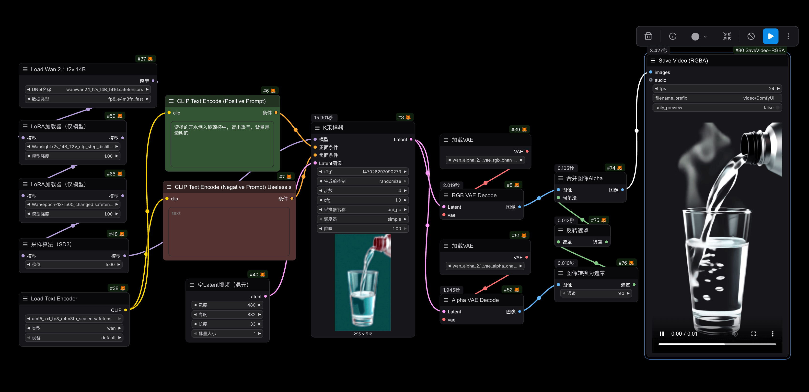

Enhanced the comfyui savevideo node to support previewing and saving videos containing alpha channels.



### 🔨Wan-Alpha Video Usage

1. Download models
- The Wan DiT base model: [wan2.1_t2v_14B_fp16.safetensors](https://huggingface.co/Comfy-Org/Wan_2.1_ComfyUI_repackaged/blob/main/split_files/diffusion_models/wan2.1_t2v_14B_fp16.safetensors)
- The Wan text encoder: [umt5_xxl_fp8_e4m3fn_scaled.safetensors](https://huggingface.co/Comfy-Org/Wan_2.1_ComfyUI_repackaged/blob/main/split_files/text_encoders/umt5_xxl_fp8_e4m3fn_scaled.safetensors)
- The LightX2V model: [lightx2v_T2V_14B_cfg_step_distill_v2_lora_rank64_bf16.safetensors](https://huggingface.co/Kijai/WanVideo_comfy/blob/main/Lightx2v/lightx2v_T2V_14B_cfg_step_distill_v2_lora_rank64_bf16.safetensors)
- RGBA Dora: [epoch-13-1500_changed.safetensors](https://huggingface.co/htdong/Wan-Alpha_ComfyUI/blob/main/epoch-13-1500_changed.safetensors)
- RGB VAE Decoder: [wan_alpha_2.1_vae_rgb_channel.safetensors.safetensors](https://huggingface.co/htdong/Wan-Alpha_ComfyUI/blob/main/wan_alpha_2.1_vae_rgb_channel.safetensors.safetensors)
- Alpha VAE Decoder: [wan_alpha_2.1_vae_alpha_channel.safetensors.safetensors](https://huggingface.co/htdong/Wan-Alpha_ComfyUI/blob/main/wan_alpha_2.1_vae_alpha_channel.safetensors.safetensors)

2. Copy the files into the `ComfyUI/models` folder and organize them as follows:

```
ComfyUI/models
├── diffusion_models
│   └── wan2.1_t2v_14B_fp16.safetensors
├── loras
│   ├── epoch-13-1500_changed.safetensors
│   └── lightx2v_T2V_14B_cfg_step_distill_v2_lora_rank64_bf16.safetensors
├── text_encoders
│   └── umt5_xxl_fp8_e4m3fn_scaled.safetensors
├── vae
│   ├── wan_alpha_2.1_vae_alpha_channel.safetensors.safetensors
│   └── wan_alpha_2.1_vae_rgb_channel.safetensors.safetensors
```

3. Copy this repo or [SaveVideoRGBA.py](SaveVideoRGBA.py) into the `ComfyUI/custom_nodes` folder.


## 🤝 Acknowledgements

- [Wan-Alpha](https://github.com/WeChatCV/Wan-Alpha) for the alpha video generate
- [ComfyUI](https://github.com/comfyanonymous/ComfyUI) for the node workflow framework